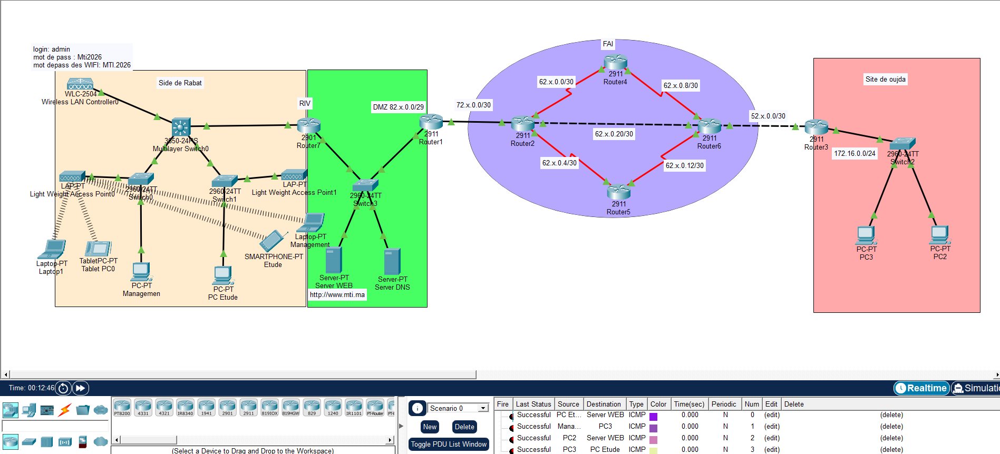

# 🌐 Architecture et Interconnexion Réseau Multi-Sites

## 📝 Présentation du Projet
Ce projet consiste en la conception, le déploiement et la validation d'une infrastructure réseau d'entreprise complète et hybride sous Cisco Packet Tracer. 

La maquette illustre l'interconnexion sécurisée entre un **Siège Social (Rabat)**, une **Succursale distante (Oujda)**, et une **Zone Démilitarisée (DMZ)** hébergeant des services publics, le tout transitant via le réseau WAN d'un **Fournisseur d'Accès Internet (FAI)**.

## 🗺️ Topologie du Réseau

*(Aperçu de la maquette globale)*

## ⚙️ Technologies et Protocoles Déployés

### 1. Réseau Local (LAN) & Commutation
* **VLANs & Segmentation :** Création du VLAN 100 pour la Production (`10.78.100.0/24`) et VLAN 200 pour le Management (`10.78.200.0/24`).
* **VTP (VLAN Trunking Protocol) :** Déploiement d'une topologie hiérarchique avec un Switch Fédérateur en mode Server et des Switchs d'accès en mode Client pour la synchronisation centralisée.
* **STP (Spanning Tree) :** Configuration du Fédérateur comme `Root Primary` pour assurer un réseau sans boucle.
* **WLAN :** Déploiement d'une architecture Wi-Fi centralisée via un **WLC** (Wireless LAN Controller), gérant des **LAPs** sécurisés par WPA2 (SSID et mots de passe personnalisés).

### 2. Routage (LAN & WAN)
* **ROAS (Router-on-a-Stick) :** Routage Inter-VLAN configuré sur le routeur de bordure de Rabat.
* **Routage Statique :** Définition des routes par défaut et spécifiques pour les réseaux d'entreprise.
* **OSPF (Routage Dynamique) :** Déploiement d'OSPF (Area 0) au cœur du FAI (adresses `62.78.x.x/30`).
* **Redistribution :** Injection des routes statiques locales dans le processus OSPF (`redistribute static subnets`).

### 3. Sécurité WAN & NAT
* **Encapsulation PPP :** Sécurisation des liaisons série du FAI avec authentification bidirectionnelle **CHAP**.
* **NAT Overload (PAT) :** Traduction des adresses IP privées des utilisateurs (`10.78.x.x` et `172.16.x.x`) en adresses publiques via des **ACLs**, permettant un accès sécurisé aux serveurs de la DMZ (`82.78.x.x`).

### 4. Services Réseau
* Déploiement de serveurs **DHCP** locaux pour l'allocation dynamique des adresses IP (VLANs de Rabat et LAN d'Oujda).
* Hébergement fonctionnel de serveurs **DNS** et **Web** (`www.mti.ma`) dans la DMZ.

## 🚀 Tests et Validation
* ✔️ Connectivité (Ping) de bout en bout validée entre tous les sous-réseaux et sites distants.
* ✔️ Accès réussi au Serveur Web de la DMZ depuis les postes clients (Résolution DNS et trafic HTTP).
* ✔️ Vérification de la translation d'adresses (NAT) sur les routeurs de bordure.

---
*Projet réalisé dans le cadre du cycle d'ingénierie en Génie Informatique Option Systèmes, Réseaux et Cloud.*
